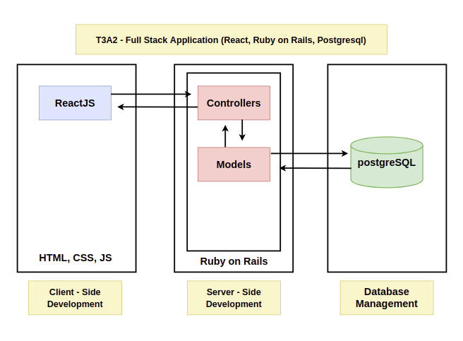
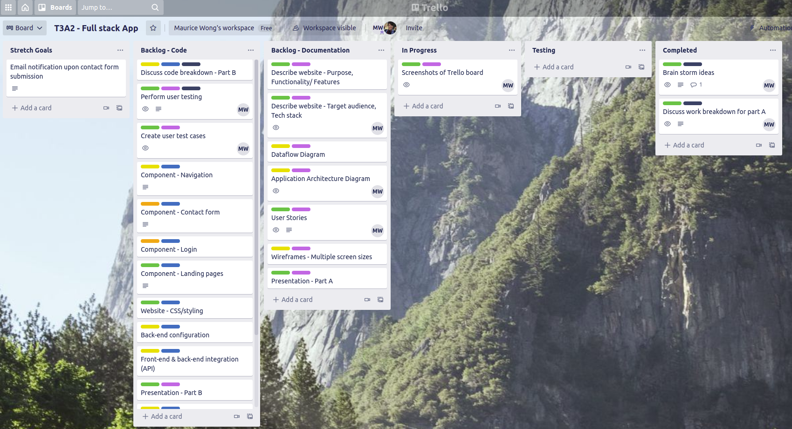

# T3A2 - Full stack App (Part A)

## Describe your website
 --- 
### **Purpose**

### **Functionality / Features**

### **Target Audience**
The target audience for the website could be anyone who would like a cake that has been professionally made. As we provide a wide range of cakes, this would attract cake enthusiasts, event organisers and people holding celebratory parties. 

### **Tech Stack**
#### Front End
- React
- JS
- HTML
- CSS
- Tailwind

#### Back End
- Ruby on Rails

#### Test
- Jest
- RSpec

#### Database 
- PostgreSQL

#### Deployment
- Heroku (Back-end)
- Netlify (Front-end) 

#### Tools 
- Visual studio code
- app.diagrams.net - for wireframes, dataflow diagram & application architecture 
- Github - source control repository  
- Trello - project management tool
- Microsoft Excel - user stories and user testing

## Dataflow Diagram
---
## Application Architecture Diagram
---

## User Stories
---
As a User, I want access to a nav bar, so that I can easily navigate the website.

As a User, I want to easily interact with the website, so that I can access the website on all my devices.

As a User, I want to see the company information, so that I can contact them if needed.

As a User, I want to see the services and products being offered, so that I can decide on what service/s to book.

As a User, I want to be able to register an account, so that I can access the booking system.

As a Signed up user, I want to be able to log into the site, so that I can access my account.

As a Logged in user, I want to sign out, so that I can end my session on the site.

As a Logged in user, I want to edit my information, so that if my information changes I can update it.

As a Logged in user, I want to submit booking information, so that a catering service can be organised.

As a Logged in user, I want to receive a confirmation email , so that I know my booking information was successfully sent.

As a Admin, I want to receive emails when a booking has been made, so that I can be notified of a booking .

As a Admin, I want to be able to delete users, so that I can remove inactive or misused accounts.

## Wireframes
---
## Screenshots of Trello board
---
Trello is the project management tool for this project used for task delegation and project progress. 

[Trello board](https://trello.com/b/isiWiAy4/t3a2-full-stack-app)

