# T3A2 - Full stack App (Part A)

## Describe your website

### **Purpose**
The purpose of the website is for Sprinkles of Joy to be able to showcase the cakes the business offers. The website also allows the business to keep track of the enquiries coming in about the business' services.

### **Functionality / Features**
#### Landing Page
The website will have an elegant landing page that will link only to the cake showcase page. It funnels users straight to the cakes page so that users see the cakes before anything else.

#### Showcase Page
The showcase page will also double as the home page. The showcase page presents either all cakes that the business offers, the most popular cakes, or the cakes that the business is most proud of. From the showcase page the user can access the cakes' individual pages that will list a description and ingredients list. 

#### Enquiries Page
The enquiries page is only accessible to users that are logged in. The page contains a contact form that allows the business to receive contact enquiries that will be emailed to the nominated admin email address.

#### Log In/Register
Users will need to register on the site in order to be able to fill out an enquiries/contact form. Logged in users will also be able to see if they have any upcoming appointments on their profile pages. 

### **Target Audience**
The target audience for the website could be anyone who would like a cake that has been professionally made. As we provide a wide range of cakes, this would attract cake enthusiasts, event organisers and any person holding celebratory parties. 

### **Tech Stack**
#### Front End
- React
- JS
- HTML
- CSS
- Tailwind

#### Back End
- Ruby on Rails

#### Test
- Jest
- RSpec

#### Database 
- PostgreSQL

#### Deployment
- Heroku (Back-end)
- Netlify (Front-end) 

#### Tools 
- Visual studio code
- app.diagrams.net - for wireframes, dataflow diagram & application architecture 
- Github - source control repository  
- Trello - project management tool
- Microsoft Excel - user stories and user testing

---
## Dataflow Diagram
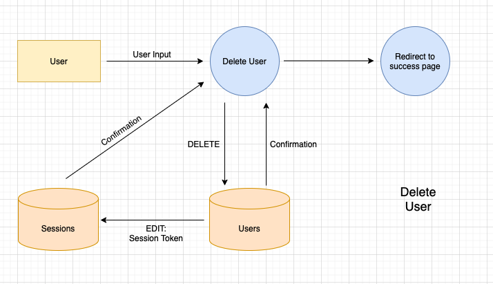
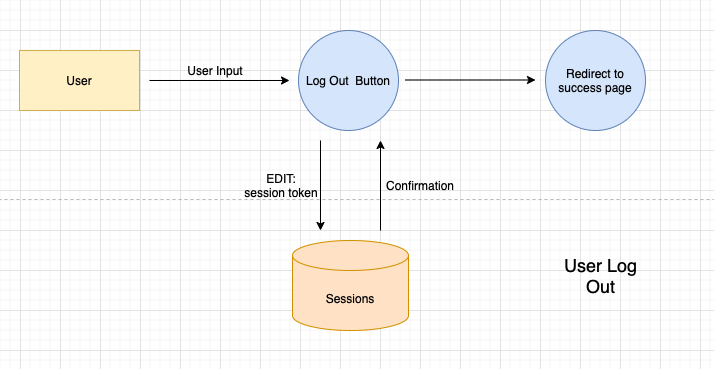
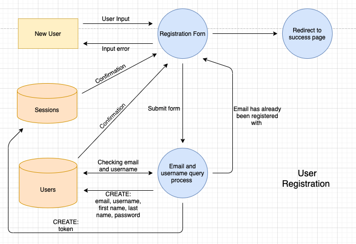
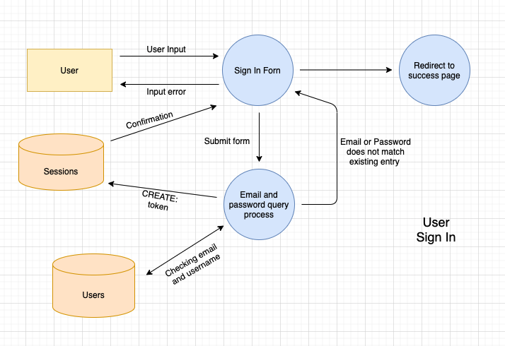
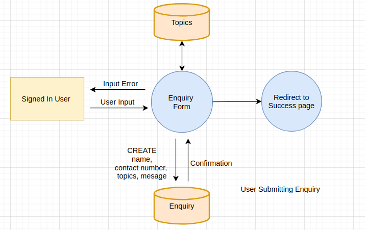

---
## Application Architecture Diagram

---
## User Stories
As a User, I want access to a nav bar, so that I can easily navigate the website.

As a User, I want to easily interact with the website, so that I can access the website on all my devices.

As a User, I want to see the company information, so that I can contact them if needed.

As a User, I want to see the services and products being offered, so that I can decide on what service/s to book.

As a User, I want to be able to register an account, so that I can access the booking system.

As a Signed up user, I want to be able to log into the site, so that I can access my account.

As a Logged in user, I want to sign out, so that I can end my session on the site.

As a Logged in user, I want to edit my information, so that if my information changes I can update it.

As a Logged in user, I want to submit booking information, so that a catering service can be organised.

As a Logged in user, I want to receive a confirmation email , so that I know my booking information was successfully sent.

As a Admin, I want to receive emails when a booking has been made, so that I can be notified of a booking .

As a Admin, I want to be able to delete users, so that I can remove inactive or misused accounts.

---
## Wireframes
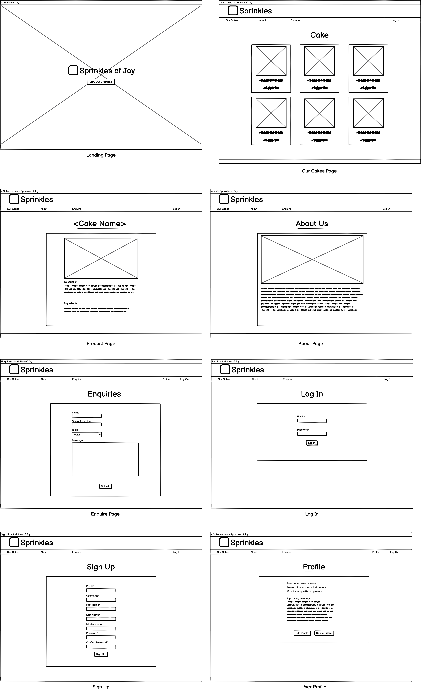
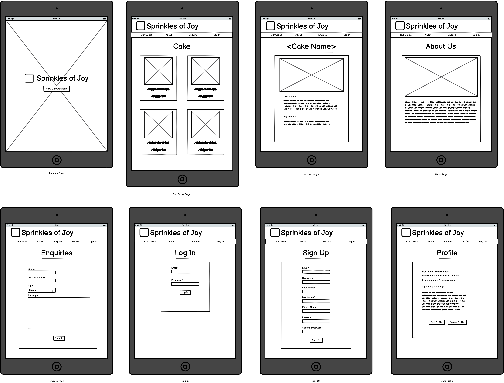
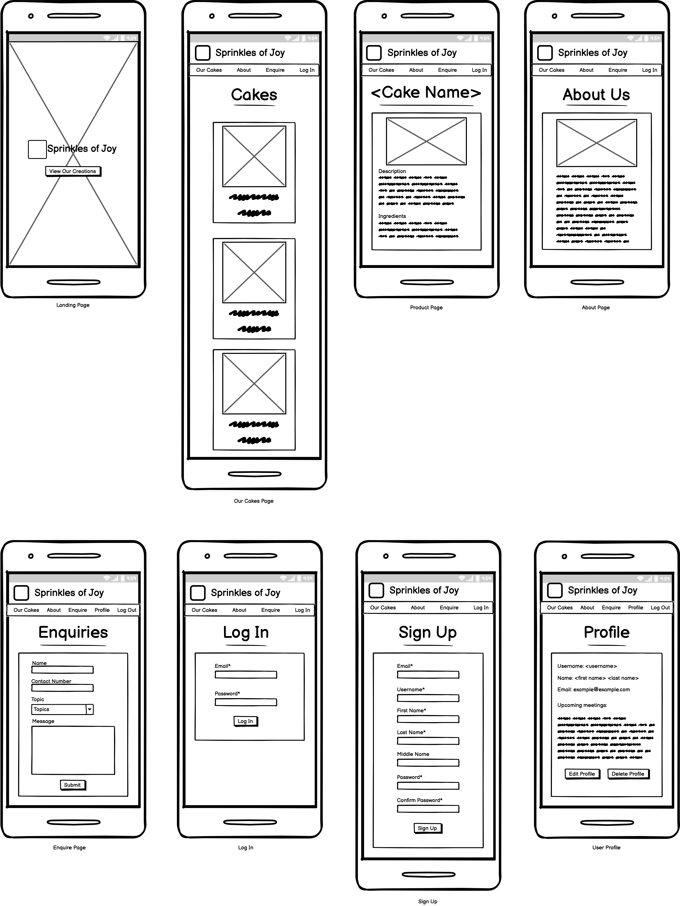

---
## Screenshots of Trello board
Trello is the project management tool for this project used for task delegation and project progress. We broke down the project into deliverable components and then classified each card under 3 categories, Tshirt sizing (which signifies time and effort required), code or documentation and weather it required both team members to work on it (discussions or brainstorming). Bigger tickets have sub-lists of task when further breakdown is required. Team members are also assigned up against the cards they have been responsible for.    

[Trello board](https://trello.com/b/isiWiAy4/t3a2-full-stack-app)

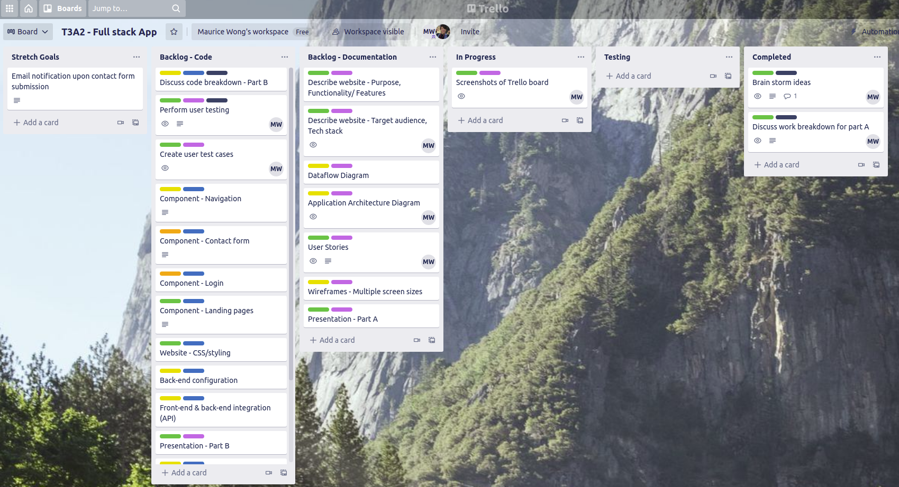
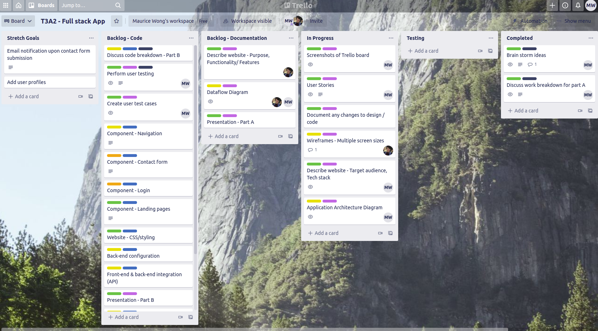
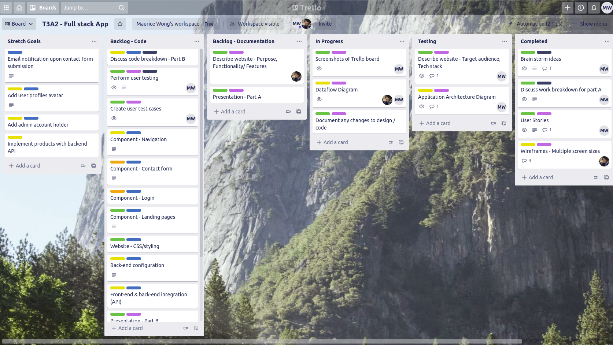
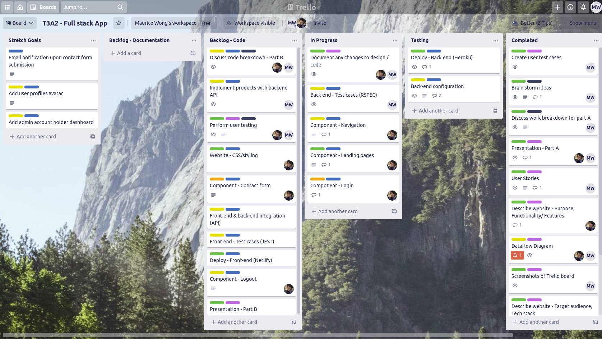
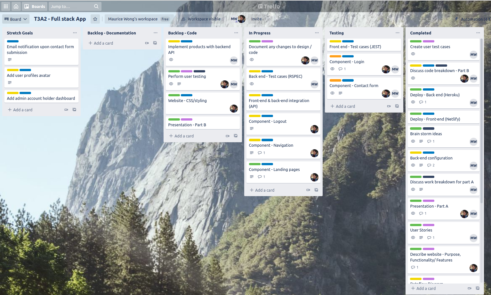
